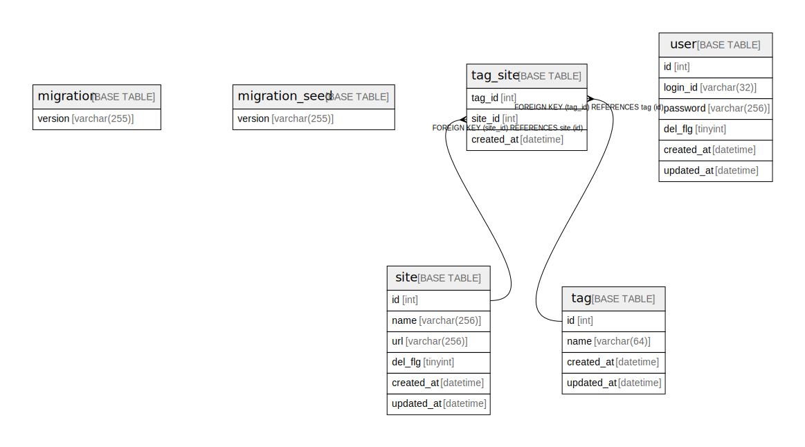

# sample_slim

## Tables

| Name | Columns | Comment | Type |
| ---- | ------- | ------- | ---- |
| [migration](migration.md) | 1 |  | BASE TABLE |
| [migration_seed](migration_seed.md) | 1 |  | BASE TABLE |
| [site](site.md) | 6 | サイトマスター | BASE TABLE |
| [tag](tag.md) | 4 | タグマスター | BASE TABLE |
| [tag_site](tag_site.md) | 3 | タグとサイトの交差テーブル | BASE TABLE |
| [user](user.md) | 6 | ユーザマスター | BASE TABLE |

## Relations

---

> Generated by [tbls](https://github.com/k1LoW/tbls)
