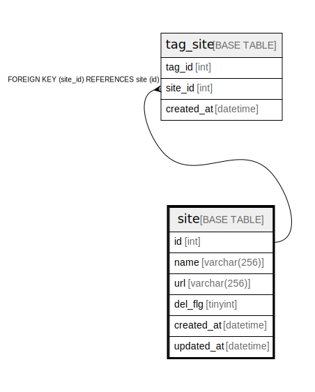

# site

## Description

サイトマスター

<details>
<summary><strong>Table Definition</strong></summary>

```sql
CREATE TABLE `site` (
  `id` int NOT NULL AUTO_INCREMENT COMMENT 'サイトID',
  `name` varchar(256) NOT NULL COMMENT 'サイト名',
  `url` varchar(256) NOT NULL COMMENT 'url',
  `del_flg` tinyint NOT NULL DEFAULT '0' COMMENT '削除フラグ',
  `created_at` datetime NOT NULL DEFAULT CURRENT_TIMESTAMP COMMENT '登録日',
  `updated_at` datetime NOT NULL DEFAULT CURRENT_TIMESTAMP ON UPDATE CURRENT_TIMESTAMP COMMENT '更新日',
  PRIMARY KEY (`id`)
) ENGINE=InnoDB AUTO_INCREMENT=[Redacted by tbls] DEFAULT CHARSET=utf8 COMMENT='サイトマスター'
```

</details>

## Columns

| Name | Type | Default | Nullable | Extra Definition | Children | Parents | Comment |
| ---- | ---- | ------- | -------- | --------------- | -------- | ------- | ------- |
| id | int |  | false | auto_increment | [tag_site](tag_site.md) |  | サイトID |
| name | varchar(256) |  | false |  |  |  | サイト名 |
| url | varchar(256) |  | false |  |  |  | url |
| del_flg | tinyint | 0 | false |  |  |  | 削除フラグ |
| created_at | datetime | CURRENT_TIMESTAMP | false | DEFAULT_GENERATED |  |  | 登録日 |
| updated_at | datetime | CURRENT_TIMESTAMP | false | DEFAULT_GENERATED on update CURRENT_TIMESTAMP |  |  | 更新日 |

## Constraints

| Name | Type | Definition |
| ---- | ---- | ---------- |
| PRIMARY | PRIMARY KEY | PRIMARY KEY (id) |

## Indexes

| Name | Definition |
| ---- | ---------- |
| PRIMARY | PRIMARY KEY (id) USING BTREE |

## Relations



---

> Generated by [tbls](https://github.com/k1LoW/tbls)
