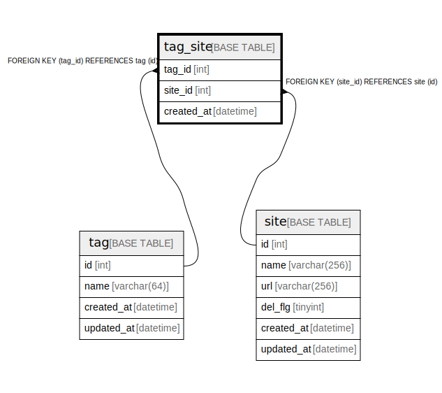

# tag_site

## Description

タグとサイトの交差テーブル

<details>
<summary><strong>Table Definition</strong></summary>

```sql
CREATE TABLE `tag_site` (
  `tag_id` int NOT NULL COMMENT 'タグID',
  `site_id` int NOT NULL COMMENT 'サイトID',
  `created_at` datetime NOT NULL DEFAULT CURRENT_TIMESTAMP COMMENT '登録日',
  PRIMARY KEY (`tag_id`,`site_id`),
  KEY `site_id` (`site_id`),
  CONSTRAINT `tag_site_ibfk_1` FOREIGN KEY (`tag_id`) REFERENCES `tag` (`id`) ON DELETE CASCADE,
  CONSTRAINT `tag_site_ibfk_2` FOREIGN KEY (`site_id`) REFERENCES `site` (`id`) ON DELETE CASCADE
) ENGINE=InnoDB DEFAULT CHARSET=utf8 COMMENT='タグとサイトの交差テーブル'
```

</details>

## Columns

| Name | Type | Default | Nullable | Extra Definition | Children | Parents | Comment |
| ---- | ---- | ------- | -------- | --------------- | -------- | ------- | ------- |
| tag_id | int |  | false |  |  | [tag](tag.md) | タグID |
| site_id | int |  | false |  |  | [site](site.md) | サイトID |
| created_at | datetime | CURRENT_TIMESTAMP | false | DEFAULT_GENERATED |  |  | 登録日 |

## Constraints

| Name | Type | Definition |
| ---- | ---- | ---------- |
| PRIMARY | PRIMARY KEY | PRIMARY KEY (tag_id, site_id) |
| tag_site_ibfk_1 | FOREIGN KEY | FOREIGN KEY (tag_id) REFERENCES tag (id) |
| tag_site_ibfk_2 | FOREIGN KEY | FOREIGN KEY (site_id) REFERENCES site (id) |

## Indexes

| Name | Definition |
| ---- | ---------- |
| site_id | KEY site_id (site_id) USING BTREE |
| PRIMARY | PRIMARY KEY (tag_id, site_id) USING BTREE |

## Relations



---

> Generated by [tbls](https://github.com/k1LoW/tbls)
