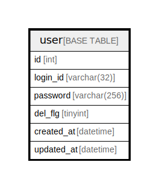

# user

## Description

ユーザマスター

<details>
<summary><strong>Table Definition</strong></summary>

```sql
CREATE TABLE `user` (
  `id` int NOT NULL AUTO_INCREMENT COMMENT 'ユーザID',
  `login_id` varchar(32) NOT NULL COMMENT 'ログインid',
  `password` varchar(256) NOT NULL COMMENT 'パスワード',
  `del_flg` tinyint NOT NULL DEFAULT '0' COMMENT '削除フラグ',
  `created_at` datetime NOT NULL DEFAULT CURRENT_TIMESTAMP COMMENT '登録日',
  `updated_at` datetime NOT NULL DEFAULT CURRENT_TIMESTAMP ON UPDATE CURRENT_TIMESTAMP COMMENT '更新日',
  PRIMARY KEY (`id`),
  UNIQUE KEY `uniq_login` (`login_id`)
) ENGINE=InnoDB AUTO_INCREMENT=[Redacted by tbls] DEFAULT CHARSET=utf8 COMMENT='ユーザマスター'
```

</details>

## Columns

| Name | Type | Default | Nullable | Extra Definition | Children | Parents | Comment |
| ---- | ---- | ------- | -------- | --------------- | -------- | ------- | ------- |
| id | int |  | false | auto_increment |  |  | ユーザID |
| login_id | varchar(32) |  | false |  |  |  | ログインid |
| password | varchar(256) |  | false |  |  |  | パスワード |
| del_flg | tinyint | 0 | false |  |  |  | 削除フラグ |
| created_at | datetime | CURRENT_TIMESTAMP | false | DEFAULT_GENERATED |  |  | 登録日 |
| updated_at | datetime | CURRENT_TIMESTAMP | false | DEFAULT_GENERATED on update CURRENT_TIMESTAMP |  |  | 更新日 |

## Constraints

| Name | Type | Definition |
| ---- | ---- | ---------- |
| PRIMARY | PRIMARY KEY | PRIMARY KEY (id) |
| uniq_login | UNIQUE | UNIQUE KEY uniq_login (login_id) |

## Indexes

| Name | Definition |
| ---- | ---------- |
| PRIMARY | PRIMARY KEY (id) USING BTREE |
| uniq_login | UNIQUE KEY uniq_login (login_id) USING BTREE |

## Relations



---

> Generated by [tbls](https://github.com/k1LoW/tbls)
